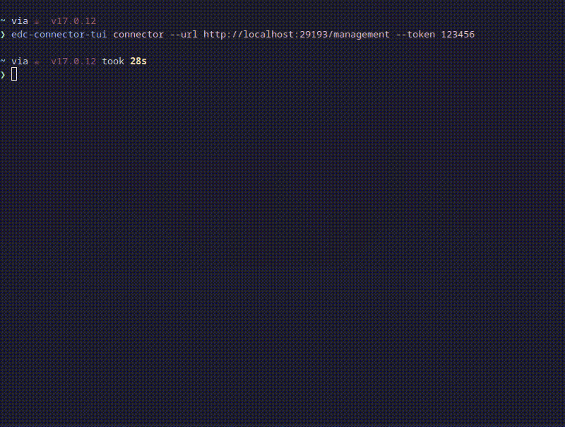

# EDC Connector TUI 

<div class="oranda-hide">
  <h1 align="center">EDC Connector TUI</h1>
</div>

<div align="center">
  <strong>
    A TUI client for <a href="https://github.com/eclipse-edc/Connector">EDC</a>.
  </strong>
</div>

<br />

<div align="center">
  <a href="https://github.com/dataspace-rs/edc-connector-tui?query=workflow%3ATests">
    
  </a>
  
  <a href="https://crates.io/crates/edc-connector-client">
    
  </a>
  <a href="https://docs.rs/edc-connector-client">
    
  </a>

   <a href="https://opensource.org/licenses/Apache-2.0">
    
  </a>

   <a href="https://deps.rs/repo/github/dataspace-rs/edc-connector-tui">
    
  </a>

</div>





### Install

Fetch a latest release [here](https://github.com/dataspace-rs/edc-connector-tui/releases)


or install with cargo

``` sh
cargo install edc-connector-tui
```


### Run

The TUI client can either run with a single connector configured via cli args:

```bash
edc-connector-tui connector --url http://localhost:29193/management --token 123456
```


or if no args provided it will try to read connectors configuration from the file at `~/.config/edc-connector-tui/config.toml`


The file should contain the list of configured connectors:

``` toml
[[connectors]]
name="FirstConnector"
address="http://localhost:29193/management"
auth= { type = "token", token_alias = "connector_alias" }

[[connectors]]
name="SecondConnector"
address="http://myconnector.xyz/management"
```


The `token_alias` is used to fetch the actual token from the system keyring for the service `edc-connector-tui`.


For configuration above the `token` could be set with `secret-tool` on Linux:

``` sh
secret-tool store --label="FirstConnector" service edc-connector-tui username connector_alias
```

> Altough `edc-connector-tui` builds for OSX and Windows are available, it has been only tested on Linux.
> Contributions are welcome for multiplatform support/testing 

