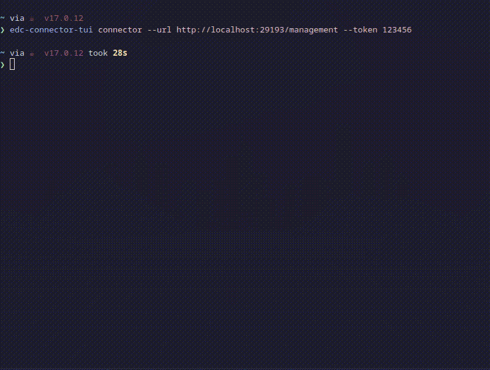

<div class="oranda-hide">
  <h1 align="center">EDC Connector TUI</h1>
</div>

<div align="center">
  <strong>
    A TUI client for <a href="https://github.com/eclipse-edc/Connector">EDC</a>.
  </strong>
</div>

<br />

<div align="center">
  <a href="https://github.com/dataspace-rs/edc-connector-tui?query=workflow%3ATests">
    
  </a>
  
  <a href="https://crates.io/crates/edc-connector-client">
    
  </a>
  <a href="https://docs.rs/edc-connector-client">
    
  </a>

   <a href="https://opensource.org/licenses/Apache-2.0">
    
  </a>

   <a href="https://deps.rs/repo/github/dataspace-rs/edc-connector-tui">
    
  </a>

</div>





### Install

Fetch a latest release [here](https://github.com/dataspace-rs/edc-connector-tui/releases)


or install with cargo

``` sh
cargo install edc-connector-tui
```


### Run

The TUI client can either run with a single connector configured via cli args:

```bash
edc-connector-tui connector --url http://localhost:29193/management --token 123456
```


or if no args provided it will try to read connectors configuration from the file at `~/.config/edc-connector-tui/config.toml`


The file should contain the list of configured connectors:

``` toml
[[connectors]]
name="FirstConnector"
address="http://localhost:29193/management"
auth= { type = "token", token_alias = "connector_alias" }

[[connectors]]
name="SecondConnector"
address="http://myconnector.xyz/management"
```


The `token_alias` is used to fetch the actual token from the system keyring for the service `edc-connector-tui`.

Supported `auth` types:

- `{ type = "no-auth" }` (default when `auth` is omitted)
- `{ type = "token", token_alias = "..." }` sends the token in the `X-Api-Key` header
- `{ type = "bearer-token", token_alias = "..." }` sends the token as `Authorization: Bearer <token>`
- `{ type = "oauth2", client_id = "...", token_url = "...", secret_alias = "..." }` fetches a token via OAuth2 client credentials
- `{ type = "token-exchange", token_exchange_url = "...", subject_token_file = "..." }` exchanges a workload credential for a JWT via OAuth2 Token Exchange (RFC 8693), sent as `Authorization: Bearer <token>`

For `token-exchange` the subject token comes from exactly one of `subject_token_file` (a path, re-read on every exchange so rotated credentials are picked up) or `subject_token_alias` (a keyring alias, like `token_alias`). Optional fields: `resource` (defaults to the connector's `participant_context_id`), `audience` (defaults to `edcv`) and `scopes` (defaults to `["management-api:read", "management-api:write"]`):

``` toml
[[connectors]]
name="Provider"
address="http://localhost:29193/management"
api_version="v5"
participant_context_id="provider"

[connectors.auth]
type="token-exchange"
token_exchange_url="http://jwtlet:8080/token"
subject_token_file="/var/run/secrets/jwtlet/token"
scopes=["management-api:read", "management-api:write"]
```


For configuration above the `token` could be set with `secret-tool` on Linux:

``` sh
secret-tool store --label="FirstConnector" service edc-connector-tui username connector_alias
```

### Managing connectors from the TUI

Connectors can also be added, edited and deleted from the `Connectors` view, so the config file
does not have to be written by hand:

- `a` opens the form to add a connector, `e` edits the highlighted one and `d` deletes it (after a `y/n` confirmation).
- `tab` and `shift+tab` move through every field, `enter` moves to the next field (and submits on `Confirm`), `up`/`down` (or `ctrl-k`/`ctrl-j`) jump between rows, `left`/`right` move within a row and `esc` closes the form.
- `API version` and `Auth type` are choice fields: `space` (or `l`) cycles to the next value and `backspace` (or `h`) to the previous one. Changing the auth type swaps the auth specific fields.
- Every change is written back to the config file (`~/.config/edc-connector-tui/config.toml` or the `--config` file). The file is regenerated from the current connectors, so comments in it are not preserved. If the file does not exist yet the TUI starts with an empty list and creates it on the first save.
- Secrets (API token, OAuth2 client secret, subject token) are optional fields next to their alias: a non-empty value is stored in the system keyring under the service `edc-connector-tui` with the alias as username (the same entry `secret-tool` creates above). Leave it blank to keep the secret already stored for that alias.

When running with the `connector` subcommand there is no config file: changes are kept in memory only.

### Admin workspace (v5)

Connectors speaking the v5 management API (`api_version = "v5"`) expose the global, participant
independent resources of an EDC-V deployment. The TUI keeps them in a separate *Admin* workspace so
they do not mix with the day-to-day views:

- `ctrl+a` toggles between the `Operations` and the `Admin` workspace; the launch bar accepts
  `:admin` and `:ops` as well. `tab`/`shift+tab` only cycle through the entries of the active
  workspace, and each workspace remembers the last view you were in. Switching is refused for v3
  and v4 connectors.
- The admin views are `Participants`, `DataspaceProfiles`, `CelExpressions`, `CachedDocuments`,
  `DcpScopes` and `SchemaValidators`. The launch bar reaches them directly with `:participants`,
  `:profiles`, `:cel`, `:cache`, `:scopes` and `:schemas`.
- Every admin view supports `a` (add), `e` (edit) and `d` (delete, after a `y/n` confirmation)
  through the same forms as the connectors view, from the list and from the detail view
  (`enter`). Some views have extra actions: `t` tests a CEL expression against an operator,
  a right operand and `ctx` parameters; `u` makes the connector fetch a cached document again;
  `l` associates dataspace profiles with a participant and `c` edits its configuration. Open the
  participant detail with `enter` first so `l` and `c` are pre-filled with the current values.
- Form conventions: lists (scopes, actions, profiles, JSON-LD context URLs) are comma separated;
  structured values (trusted issuers, cached document content, properties, config entries) are
  typed as single-line JSON; a blank id lets the connector generate one; ids and profile names
  cannot be changed when editing.
- The admin APIs require a token with the `management-api:admin` scope, e.g. for token exchange:

```toml
[connectors.auth]
type="token-exchange"
token_exchange_url="http://jwtlet:8080/token"
subject_token_file="/var/run/secrets/jwtlet/token"
scopes=["management-api:admin"]
```

> Altough `edc-connector-tui` builds for OSX and Windows are available, it has been only tested on Linux.
> Contributions are welcome for multiplatform support/testing 

